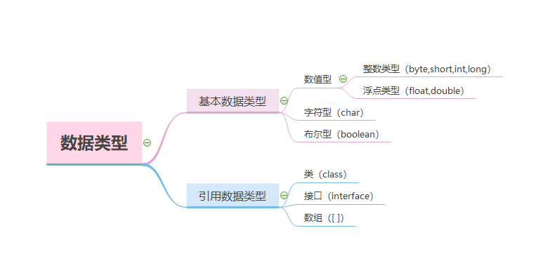
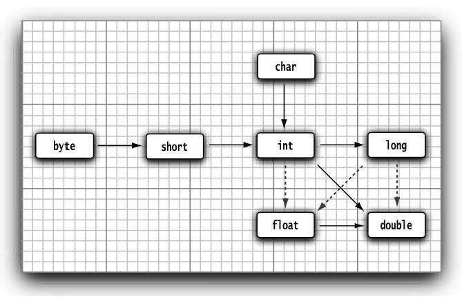

***

### 整型数据

long型数值后有一个后缀L或l(如4000000000L)

十六进制有前缀0x或0X

八进制有前缀0(容易混淆)

二进制数有前缀0b或0B

可以为数字字面量加下划线（如0b1111_0100_0010_0100_0000）使数字更加易读。

java中没有任何无符号形式的整型。

***

### 浮点型数据
绝大多数情况下都使用double类型。

float类型的数值有一个后缀F或f（例如，3.14F）没有后缀F的浮点数值（如3.14）默认为double类型。当然，也可以在浮点数值后面添加后缀D或d（例如，3.14D）

***

### char型
char类型的字面量值要用单引号括起来。例如：'A'是编码值为65所对应的字符常量。它与"A"不同，"A"是包含一个字符A的字符串。

char类型的值可以表示为十六进制值，其范围从\u0000到\Uffff。例如：\u2122表示注册符号（TM），\u03C0表示希腊字母π。

反斜线、单引号、双引号等char型数据都需要在单引号内部进行转义。

### boolean型

java中boolean不能和int型的0和1进行相互转换

### 数值类型之间的转换


图中6个实心箭头表示无信息丢失的转换；3个虚箭头表示可能有精度损失的转换。

```java
int i = 123456789;
float f = i; // f is 1.23456792E8
```

当整数数值和浮点数数值进行二元操作时，先要将两个操作数转换为同一种类型，然后再进行计算。

+ 如果两个操作数中有一个是double类型，另一个操作数就会转换为double类型。

+ 否则，如果其中一个操作数是float类型，另一个操作数将会转换为float类型。

+ 否则，如果其中一个操作数是long类型，另一个操作数将会转换为long类型。

+ 否则，两个操作数都将被转换为int类型。

***

### 强制类型转换

```java
double x = 9.997;
int nx = int(x); //nx is 9
```

强制类型转换无法保证四舍五入运算。四舍五入转换需要使用`Math.round`方法:

```java
double x = 9.97;
int nx = (int)Math.round(x); // nx is 10
```

注意，使用`Math.round`方法时仍要使用强制类型转换，因为round方法返回的结果为long类型，由于存在信息丢失的可能性，所以只有使用显式的强制类型转换才能够将long型转换为int型。

如果试图将一个数值从一种类型强制转换为另一种类型，而又超出了目标类型的表示范围，结果就会截断成一个完全不同的值。例如，（byte）300的实际值为44。

***

### 大数值

如果基本的整数和浮点数精度不能够满足需求，那么可以使用java.math包中的两个很有用的类`BigInteger`和`BigDecimal`。这两个类可以处理包含任意长度数字序列的数值。`BigInteger`类实现了任意精度的整数运算，`BigDecimal`实现了任意精度的浮点数运算。
使用静态的valueOf方法可以将普通的数值转换为大数值：
```java
BigInteger a = BigInteger.valueOf(100);
```

处理大数值需要使用大数值类中的add和multiply方法。
```java
BigInteger c = a.add(b); 
BigInteger d = c.multiply(b.add(BigInteger.valueOf(2)));
```

#### BigInteger类和BigDecimal类常用方法
####  java.math.BigInteger
+ BigInteger add（BigInteger other）
+ BigInteger subtract（BigInteger other）
+ BigInteger multiply（BigInteger other）
+ BigInteger divide（BigInteger other）
+ BigInteger mod（BigInteger other）
返回这个大整数和另一个大整数other的和、差、积、商以及余数。

+ int compareTo（BigInteger other）
如果这个大整数与另一个大整数other相等，返回0；如果这个大整数小于另一个大整数other，返回负数；否则，返回正数。

+ static BigInteger valueOf（long x）
返回值等于x的大整数。

#### java.math.BigInteger
+ BigDecimal add（BigDecimal other）
+ BigDecimal subtract（BigDecimal other）
+ BigDecimal multiply（BigDecimal other）
+ BigDecimal divide（BigDecimal other，RoundingMode mode）5.0
返回这个大实数与另一个大实数other的和、差、积、商。要想计算商，必须给出舍入方式（rounding mode）。RoundingMode.HALF_UP是在学校中学习的四舍五入方式（即，数值0到4舍去，数值5到9进位）。它适用于常规的计算。

+ int compareTo（BigDecimal other）
如果这个大实数与另一个大实数相等，返回0；如果这个大实数小于另一个大实数，返回负数；否则，返回正数。

+ static BigDecimal valueOf（long x）

+ static BigDecimal valueOf（long x，int scale）
返回值为x或x/10scale的一个大实数。
