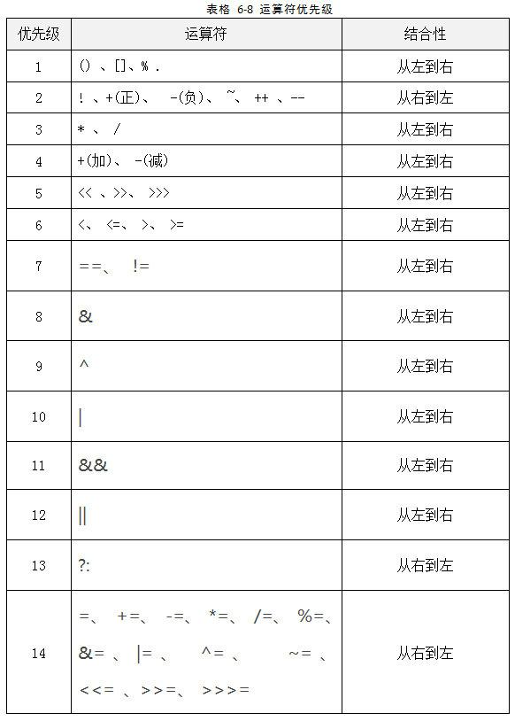
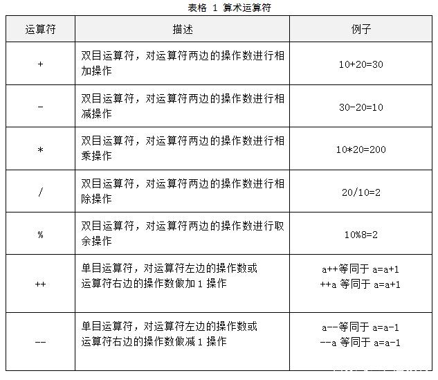
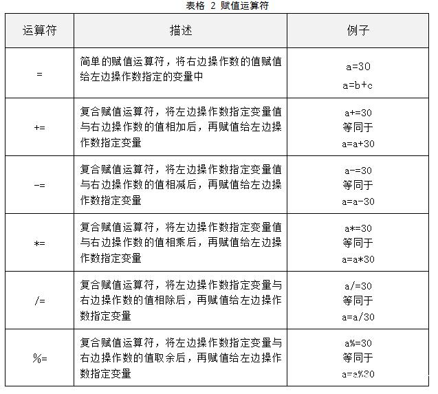
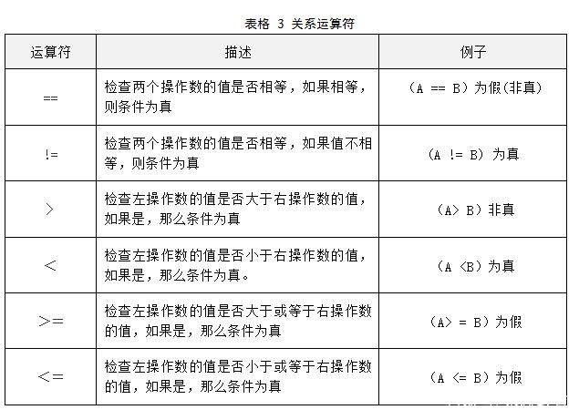
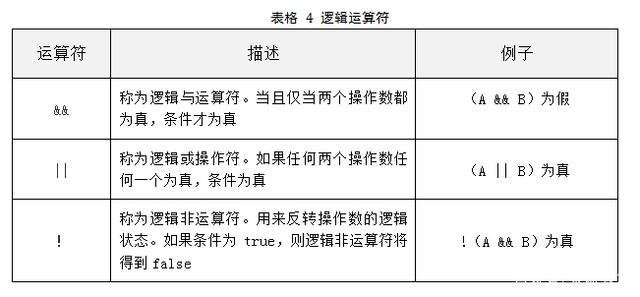

### 运算符优先级

***

### 算术运算符

当参与/运算的两个操作数都是整数时，表示整数除法；否则，表示浮点除法。整数的求余操作（有时称为取模）用%表示。

需要注意，整数被0除将会产生一个异常，而浮点数被0除将会得到无穷大或NaN结果。

自增和自减运算符即可以放在变量的前面，也可以放在变量的后面，例如++a、 a++。

自增（++）：将变量的值加1，分前缀式（如++a）和后缀式（如a++）。前缀式是先加1再使用；后缀式是先使用再加1。

自减（--）：将变量的值减1，分前缀式（如--a）和后缀式（如a--）。前缀式是先减1再使用；后缀式是先使用再减1。

***

### 赋值运算符

***

### 关系运算符

***

### 逻辑运算符

使用&&和||时，如果第一个操作数已经能够确定表达式的值，第二个操作数就不必计算了。可以利用这一点来避免错误，例如，在`x != 0 && 1 / x > x + y`中，如果`x`等于0，那么第二部分就不会计算了。因此，除以0的错误就不会出现。

***

### 条件运算符（三元运算符）

Java支持三元操作符`？：` 条件为True时表达式就为第一个表达式的值，否则为第二个的值。

这个操作符有时很有用。例如，`x < y ? x : y `会返回x和y中较小的一个。

***

### 位运算符
位运算符用来对二进制位进行操作，包括按位取反（~）、按位与（&）、按位或（|）、异或（^）、右移（>>）、左移（<<）和无符号右移（>>>）。位运算符只能对整数型和字符型数据进行操作。

1. 取反（~）

参加运算的一个数据，按二进制位进行“取反”运算。

运算规则：~1=0； ~0=1；

即：对一个二进制数按位取反，即将0变1，1变0。

2. 按位与（&）

参加运算的两个数据，按二进制位进行“与”运算。

运算规则：0&0=0; 0&1=0; 1&0=0; 1&1=1；即：两位同时为“1，结果才为“1，否则为0。

例如：3&5 即 0000 0011 & 0000 0101 = 0000 0001 因此，3 & 5的值得1。

3. 按位或（|）

参加运算的两个对象，按二进制位进行“或”运算。

运算规则：0 | 0=0； 0 | 1=1； 1 | 0=1； 1 | 1=1；

即 ：参加运算的两个对象只要有一个为1，其值为1。

例如：3 | 5，即 0000 0011 | 0000 0101 = 0000 0111 因此，3 | 5的值得7。

4. 异或（^）

参加运算的两个数据，按二进制位进行“异或”运算。

运算规则：0^0=0； 0^1=1； 1^0=1； 1^1=0；

即：参加运算的两个对象，如果两个相应位为“异”（值不同），则该位结果为1，否则为0。

5. 左移（<<）

运算规则：按二进制形式把所有的数字向左移动对应的位数，高位移出（舍弃），低位的空位补零。例如： 12345 << 1，则是将数字12345左移1位：

位移后十进制数值变成：24690，刚好是12345的二倍，所以有些人会用左位移运算符代替乘2的操作，但是这并不代表是真的就是乘以2，很多时候，我们可以这样使用，但是一定要知道，位移运算符很多时候可以代替乘2操作，但是这个并不代表两者是一样的。

思考一下：如果任意一个十进制的数左位移32位，右边补位32个0，十进制岂不是都是0了？当然不是！！！ 当int 类型的数据进行左移的时候，当左移的位数大于等于32位的时候，位数会先求余数，然后再进行左移，也就是说，如果真的左移32位 12345 << 32 的时候，会先进行位数求余数，即为 12345<<(32%32) 相当于 12345<< 0 ，所以12345<< 33 的值和12345<<1 是一样的，都是 24690。

6. 右移（>>）

同样，还是以12345这个数值为例，12345右移1位： 12345>>1。

右移后得到的值为 6172 和int 类型的数据12345除以2取整所得的值一样，所以有些时候也会被用来替代除2操作。另外，对于超过32位的位移，和左移运算符一样，会先进行位数求余数。

7. 无符号右移（>>>）

无符号右移运算符和右移运算符是一样的，不过无符号右移运算符在右移的时候是补0的，而右移运算符是补符号位的。以下是-12345二进制表示：

