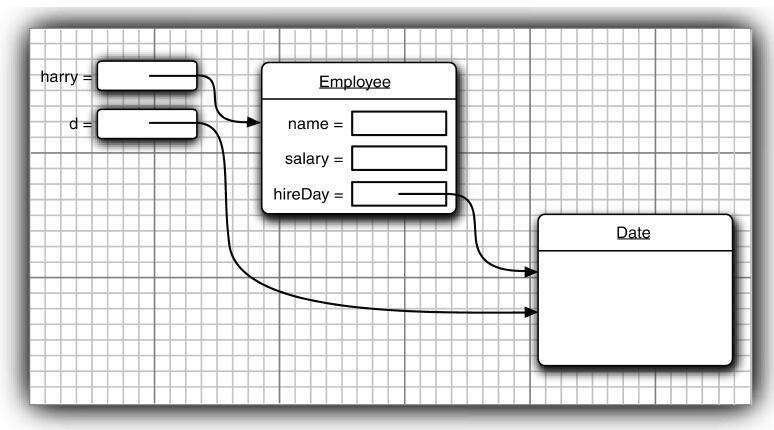

### 自定义Emloyee类
```java
class Employee {
    // 三个实例域用来存放要操作的数据
    // 关键字private确保只有Employee类自身的方法能够访问这些实例域，而其他类的方法不能够读写这些域。
    private String name;
    private double salary;
    private LocalDate hireDay;
    
    public Employee(String n,double s,int year,int month,int day)
    {
        name= n;
        salary = s;
        hireDay = LocalDate.of(year, month, day);
    }
    
    // 以下为三个典型的访问器方法。由于它们只返回实例域值，因此又被成为域访问器。
    public String getName() {
        return name;
    }
    public double getSalary() {
        return salary;
    }
    public LocalDate getHireDay() {
        return hireDay;
    }
    public void rasieSalary(double byPercent)
    {
        double raise = salary * byPercent / 100;
        salary += raise;
    }
}
```

***

### 构造器

不使用显式构造的话系统会默认提供隐式无参构造器。

Emloyee的构造器代码如下:
```java
public Employee(String n,double s,int year,int month,int day)
{
    name= n;
    salary = s;
    hireDay = LocalDate.of(year, month, day);
}
```
例如，可以这样创建实例:`new Employee("Tsj", 10000, 2000, 4, 24)`

构造器与其他的方法有一个重要的不同。构造器总是伴随着new操作符的执行被调用，而不能对一个已经存在的对象调用构造器来达到重新设置实例域的目的。

+ 构造器与类同名
+ 每个类可以有一个以上的构造器
+ 构造器可以有0个、1个或多个参数
+ 构造器没有返回值
+ 父类的构造器不会被子类继承

要注意，不要在构造器中定义与实例域重名的局部变量。例如，下面的构造器将无法设置salary。
```java
public Employee(String n,double s){
    String name = n; //Error
    double salary = s; //Error
}
```
这个构造器声明了局部变量name和salary。这些变量屏蔽了同名的实例域，只能在构造器内部访问。必须注意在所有的方法中不要命名与实例域同名的变量。

***

### 构造器的重载
构造器的重载与方法的重载类似。构造器的重载就是为了方便调用方可以灵活地创建出不同需要的对象。

***

### 访问器方法
注意不要编写返回引用可变对象的访问器方法。下面的例子就违反了这个设计原则，其中的getHireDay方法返回了一个Date类对象：
```java
class Employee{
    private Date hireDay;
    ...
    public Date getHireDay{
        return hireDay; //Bad
    }
    ...
}
```
LocalDate类没有更改器方法，与之不同，Date类有一个更改器方法setTime，可以在这里设置毫秒数。

Date对象是可变的，这一点就破坏了封装性！请看下面这段代码：
```java
Employee harry = ... ;
Date d = harry.getHireDay();
double tenYearsInMillsSeconds = 10 * 365.25 * 24 * 60 * 60 * 1000;
d.setTime(d.getTime() - (long)tenYearsInMillsSeconds);
```
出错的原因很微妙。d和harry.hireDay引用同一个对象。对d调用更改器方法就可以自动地改变这个雇员对象的私有状态！



如果需要返回一个可变对象的引用，应该首先对它进行克隆（clone）。对象clone是指存放在另一个位置上的对象副本。下面是修改后的代码：
```java
class Employee{
    private Date hireDay;
    ...
    public Date getHireDay{
        return (Date)hireDay.clone(); 
    }
    ...
}
```
凭经验可知，如果需要返回一个可变数据域的拷贝，就应该使用clone。

***

### 基于类的访问权限
下面看一下用来比较两个雇员的equals方法。
```java
class Employee{
    ...
    public boolean equals(Employee other){
        return name.equals(other.name); 
    }
}
```
典型的调用方式是:`if(harry.equals(boss))...`
 
这个方法访问harry的私有域，这点并不会让人奇怪，然而，它还访问了boss的私有域。这是合法的，其原因是boss是Employee类对象，而Employee类的方法可以访问Employee类的任何一个对象的私有域。

***

### final实例域
可以将实例域定义为final。构建对象时必须初始化这样的域。也就是说，必须确保在每一个构造器执行之后，这个域的值被设置，并且在后面的操作中，不能够再对它进行修改。

例如，可以将Employee类中的name域声明为final，因为在对象构建之后，这个值不会再被修改，即没有setName方法。
 
final修饰符大都应用于基本（primitive）类型域，或不可变（immutable）类的域（如果类中的每个方法都不会改变其对象，这种类就是不可变的类。例如，String类就是一个不可变的类）。

***

### 四种访问权限修饰符

修饰符|类内部|同一个包|子类|除前面情况外的任意情况
-|-|-|-|-
private| √| | |
（缺省）|√|√| | 
protected|√|√|√| 
public|√|√|√|√

+ 如果子类和父类在同一个包下，只要父类的成员修饰符不是私有的（private）那子类就可以使用。
+ 如果子类和父类不在同一个包下，子类只能使用父类中protected和public修饰的成员。

***
