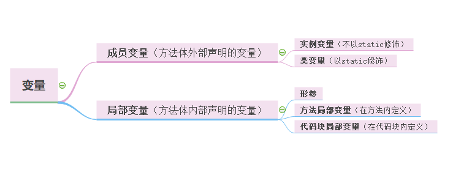

### 对象的属性

修饰符private：该属性只能由该类的方法访问。
修饰符public：该属性可以被该类以外的方法访问。



#### 成员变量和局部变量
+ 成员变量：
成员变量定义在类中，在整个类中都可以被访问。
成员变量分为类成员变量和实例成员变量，实例变量存在于对象所在的堆内存中。
成员变量有默认初始化值。
成员变量的权限修饰符可以根据需要，选择任意一个

+ 局部变量：
局部变量只定义在局部范围内，如：方法内，代码块内等。
局部变量存在于栈内存中。作用的范围结束，变量空间会自动释放。
局部变量没有默认初始化值，每次必须显式初始化。
局部变量声明时不指定权限修饰符。

#### 实例变量和类变量
实例变量是在类实例化成对象之后才能使用的。

类变量是静态的，不需要类实例化成对象，直接就可以通过类名.属性这样的方式直接调用。

***
### 显示参数和隐式参数
在rasieSalary方法中:
```java
public void rasieSalary(double byPercent)
{
    double raise = salary * byPercent / 100;
    salary += raise;
    }
}
```
共有两个参数。第一个参数称为隐式（implicit）参数，即类的属性。第二个参数位于方法名后面括号中的数值，这是一个显式（explicit）参数。
可以看到，显式参数是明显地列在方法声明中的，例如`double byPercent`。
在每一个方法中，关键字this表示隐式参数。如果需要的话，可以用下列方式编写raiseSalary方法：
```java
public void rasieSalary(double byPercent)
{
    double raise = this.salary * byPercent / 100;
    this.salary += raise;
    }
}
```

***
### this关键字
1. 调用属性、方法
```java
class Person{		
	private String name ;	
	private int age ;

	public Person(String name,int age){	
		this.name = name ;   
		this.age = age ;  }  // 调用属性

	public void getInfo(){	
		System.out.println("姓名：" + name) ;
		this.speak();  // 调用方法
	}

	public void speak(){
		System.out.println(“年龄：” + this.age);  // 调用属性，增强阅读性
	}
}
```

2. 调用本类的构造器
```java
class Person{		// 定义Person类
	private String name ;		
	private int age ;	

	public Person(){	  // 无参构造
		System.out.println("新对象实例化") ;
	}

	public Person(String name){
		this();      // 调用本类中的无参构造方法
		this.name = name ;	
	}

	public Person(String name,int age){	
		this(name) ;  // 调用有一个参数的构造方法
		this.age = age;
	}

	public String getInfo(){	
		return "姓名：" + name + "，年龄：" + age ;
	}  }
```
+ 使用this()必须放在构造器的首行！
+ 使用this调用本类中其他的构造器，保证至少有一个构造器是不用this的。

***

