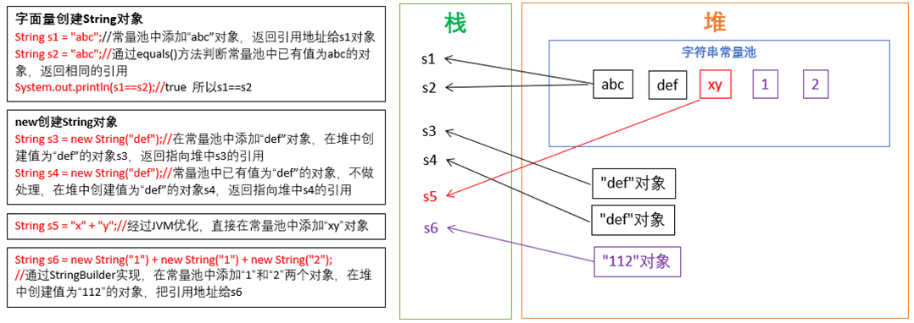

### == ：
1. 基本类型比较值:只要两个变量的值相等，即为true.

2. 引用类型比较引用(是否指向同一个对象):只有指向同一个对象时，==才返回true.
```java
Person p1=new Person();   
Person p2=new Person();
if (p1==p2){…}
```

用“==”进行比较时，符号两边的数据类型必须兼容(相同的数据类型或继承关系，可自动转换的基本数据类型除外)，否则编译出错。

***

### equals()：
equals()是Object中的方法。所有类都继承了Object，也就获得了equals()方法。还可以重写。

只能比较引用类型，其作用与“==”相同,比较是否指向同一个对象。	 

特例：当用equals()方法进行比较时，对类File、String、Date及包装类（Wrapper Class）来说，是比较类型及内容而不考虑引用的是否是同一个对象。因为在这些类中重写了Object类的equals()方法。

***

### String对象的创建

可以看出，通过字面量创建更节省内存。

***

### 练习
```java
int it = 65;
float fl = 65.0f;
System.out.println(“65和65.0f是否相等？” + (it == fl)); //true

char ch1 = 'A'; char ch2 = 12;
System.out.println(“65和‘A’是否相等？” + (it == ch1));//true，65是A的ASCII码
System.out.println(“12和ch2是否相等？” + (12 == ch2));//true

String str1 = new String("hello");
String str2 = new String("hello");
System.out.println(“str1和str2是否相等？”+ (str1 == str2));//false，不是同一个对象

System.out.println(“str1是否equals str2？”+(str1.equals(str2)));//true，特殊情况，在String中equals是用来比较值的

System.out.println(“hello” == new java.sql.Date()); //编译不通过
```

```java
Person p1 = new Person();
p1.name = "atguigu";

Person p2 = new Person();
p2.name = "atguigu";

System.out.println(p1.name .equals( p2.name));//true，name属性是字符串
System.out.println(p1.name == p2.name);//true

String s1 = new String("bcde");

String s2 = new String("bcde");
System.out.println(s1==s2);//false

```
